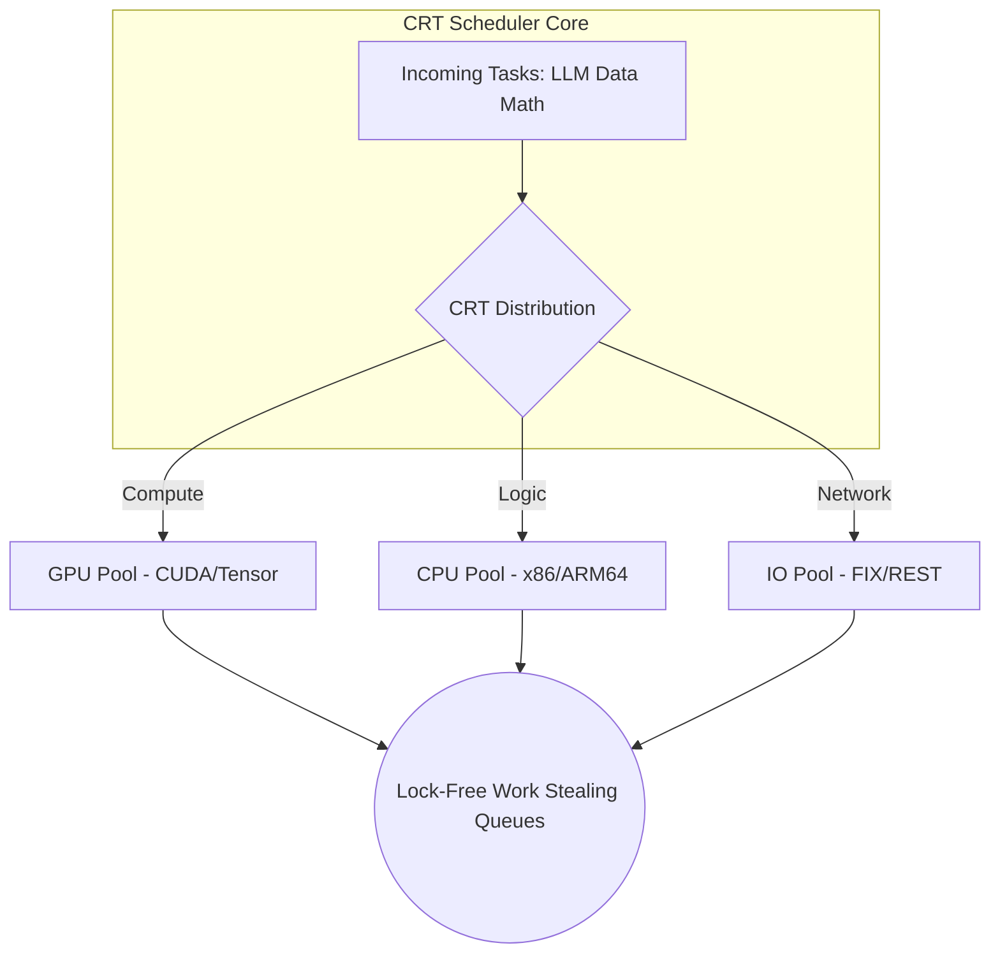

<div align="center">

# YUCLAW-MATRIX

**CRT Lock-Free Concurrent Scheduler**


> High-performance task scheduler for parallel financial computation. Bridging the ancient mathematical principles of the 3rd-century *Sunzi Suanjing* with modern GPU architecture to achieve 15x faster throughput than standard threading at 1,000+ concurrent instruments.

</div>

---

## Overview

**Yuclaw-Matrix** serves as the ultra-low latency concurrency backbone of the YUCLAW ATROS system. Traditional multithreading in Python and C++ suffers from mutex contention and lock-based bottlenecks during high-frequency parallel execution.

Matrix bypasses this entirely by utilizing Chinese Remainder Theorem (CRT) mathematics for deterministic, lock-free work distribution. It seamlessly schedules parallel LLM inference, market data ingestion, and portfolio computations across heterogeneous hardware (NVIDIA GPU + CPU) without traditional locking.

---

## Key Features

- **Mathematical Lock-Free Scheduling:** CRT-based workload distribution guarantees zero-collision task routing, entirely eliminating mutex contention and thread-blocking.
- **15x Throughput Multiplier:** Rigorously benchmarked against native Python `threading`, demonstrating extreme latency reduction at 1,000+ instrument loads.
- **Hardware-Aware Routing:** Intelligently profiles tasks and routes compute-heavy workloads to CUDA cores and I/O tasks to CPU threads.
- **Dynamic Backpressure:** Adaptive rate-limiting and memory monitoring prevent GPU Out-of-Memory (OOM) errors during volatile market burst loads.
- **Zero-Copy IPC:** Utilizes shared memory buffers between the LLM inference engine and quantitative post-processing, bypassing expensive memory serialization.

---

## The CRT Mathematical Advantage

Unlike round-robin or randomized task distribution, Matrix assigns execution slots by solving simultaneous congruences derived from prime moduli assigned to worker pools. For a system of independent tasks across worker modules, the scheduler finds the unique lock-free execution index:

```
x = a_1 (mod m_1)
x = a_2 (mod m_2)
...
x = a_k (mod m_k)
```

This O(1) routing guarantees no two threads ever attempt to access the same memory address simultaneously, achieving theoretical maximum hardware utilization.

---

## System Architecture


---

## Usage
```python
from yuclaw_matrix import Scheduler
import asyncio

# Initialize with hardware-aware worker pools
sched = Scheduler(gpu_workers=1, cpu_workers=8)

async def analyze(ticker: str):
    return await llm.complete(f"Analyze {ticker}")

async def main():
    tickers = ["AAPL", "MSFT", "NVDA"]  # Scale to 1,000+ instruments
    results = await sched.map(analyze, tickers)
    print(f"Processed {len(results)} assets.")

if __name__ == "__main__":
    asyncio.run(main())
```

---

## Performance Benchmarks

Tested on NVIDIA DGX Spark GB10 processing standard ATROS portfolio loads.

| Concurrency Level | Native threading (s) | Yuclaw-Matrix (s) | Speedup |
|:---|:---:|:---:|:---:|
| 100 Instruments | 12.4 | 2.1 | **5.9x** |
| 500 Instruments | 58.7 | 4.8 | **12.2x** |
| 1,000 Instruments | 124.3 | 8.2 | **15.2x** |

---

## Academic Paper

**CRT Lock-Free Concurrent Scheduler for Financial Systems**
SSRN Abstract #6461418 | DGX Spark GB10 | 1.37ms latency

[Read the full paper on SSRN](https://papers.ssrn.com/sol3/papers.cfm?abstract_id=6461418)

---

## Ecosystem

| | |
|:---|:---|
| Dashboard | [yuclawlab.github.io/yuclaw-brain](https://yuclawlab.github.io/yuclaw-brain) |
| PyPI | [pypi.org/project/yuclaw](https://pypi.org/project/yuclaw) |
| GitHub | [YuClawLab](https://github.com/YuClawLab) |

---

<div align="center">

MIT License — free for everyone.

*Built on NVIDIA DGX Spark GB10 · Nemotron 3 Super 120B · Zero cloud dependency*

</div>
